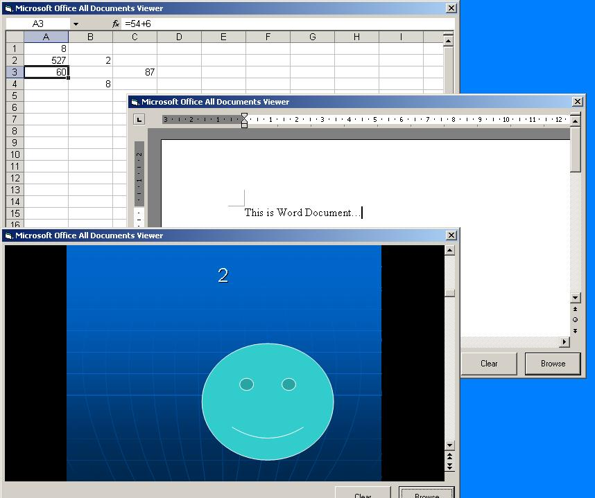



## All Microsoft Office Documents Viewer

### Description

This is a project that views all ms office (2000,xp,2003,2007) documents (word, excel, powerpoint) in it. but please if any one know how to hide the (open/save as) prompt box please tell me asap. Thank you...
 
### More Info
 

             |
---                |---
**Submitted On**   |2008-03-12 13:20:12
**By**             |[Ahmad Eissa](https://github.com/Planet-Source-Code/PSCIndex/blob/master/ByAuthor/ahmad-eissa.md)
**Level**          |Intermediate
**User Rating**    |3.0 (12 globes from 4 users)
**Compatibility**  |VB 6\.0
**Category**       |[Microsoft Office Apps/VBA](https://github.com/Planet-Source-Code/PSCIndex/blob/master/ByCategory/microsoft-office-apps-vba__1-42.md)
**World**          |[Visual Basic](https://github.com/Planet-Source-Code/PSCIndex/blob/master/ByWorld/visual-basic.md)
**Archive File**   |[All\_Micros2105873132008\.zip](https://github.com/Planet-Source-Code/ahmad-eissa-all-microsoft-office-documents-viewer__1-70254/archive/master.zip)

